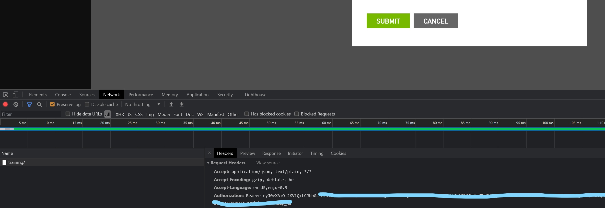

# Unofficial CLI client for air.nvidia.com

## Installation

To install the latest stable version run:

```
curl -L https://github.com/networkop/airctl/releases/latest/download/airctl_linux_x86_64.tar.gz | tar -zxvf - -C ~/.local/bin
```

### Build from source 

This comman will install the latest version from the `main` branch:
```
$ go install github.com/networkop/airctl@latest
$ ls ~/go/bin/airctl
/home/user/go/bin/airctl
```


## Usage

```

### airctl defines a number of top-level verbs allowing interaction with platform resources

$ airctl
unofficial CLI client for air.nvidia.com

Usage:
  airctl [command]

Available Commands:
  get         Display one or many resources
  set         Update existing resources
  create      Create a resource from a file
  delete      Delete resources by name or ID
  login       Authenticate with air.nvidia.com
  help        Help about any command

Flags:
  -d, --debug     Enable debug-level logging
  -h, --help      help for airctl
  -v, --version   version for airctl

Use "airctl [command] --help" for more information about a command.


### Let's try to login

$ airctl login bla 
Login Failed


### This time with the correct token

$ airctl login eyJ0eXAiOiJK...
Authentication successful


### Let's see what trainings we've got available

$ airctl get training 
+---------------------------------+--------------------------------------+--------+
| NAME                            | SIM ID                               | PUBLIC |
+---------------------------------+--------------------------------------+--------+
| Cumulus Linux Test Drive        | 66aa0e94-e9f2-4bc7-af3a-caa9e67390c0 | false  |
| NVIDIA SONiC Virtual Test Drive | d79b7690-572e-495f-b03e-08027fcc54e0 | false  |
| SONiC Spines                    | 22be8551-6eff-48cf-8672-8fdac9023dde | true   |
| SONiC Demo                      | f5fa7bf6-6922-4ebd-a133-68e682f96a0b | true   |
| Academy ILT                     | 48732f95-43ea-4f42-af42-8c4ef50bf7a3 | false  |
+---------------------------------+--------------------------------------+--------+


### Currently there are no sims running

$ airctl get sim 
+------+----+-------+
| NAME | ID | STATE |
+------+----+-------+
+------+----+-------+


### This is how you would create a sim

$ airctl create sim 
Error: Either simID or topoID must be provided
Usage:
  airctl create sim [flags]

Flags:
  -c, --citc          Create a citc sim
  -h, --help          help for sim
  -s, --sim string    ID of an existing sim to clone
  -t, --topo string   ID of an existing topo to create

Global Flags:
  -d, --debug   Enable debug-level logging

Either simID or topoID must be provided


### Let's create a sim based off the Cumulus Linux Test Drive training


$ airctl create sim -s 66aa0e94-e9f2-4bc7-af3a-caa9e67390c0 
8f1740ac-eeb9-4b88-8e54-70ac2468c314
$ airctl get sim 
+------+--------------------------------------+---------+
| NAME | ID                                   | STATE   |
+------+--------------------------------------+---------+
|      | 8f1740ac-eeb9-4b88-8e54-70ac2468c314 | LOADING |
+------+--------------------------------------+---------+


### Now let's create a CITC sim

$ airctl create sim -c 
01bed997-9eec-40c8-8f5e-56c6b1f30ab8


### Now we have 2 sims

$ airctl get sim 
+------+--------------------------------------+---------+
| NAME | ID                                   | STATE   |
+------+--------------------------------------+---------+
|      | 01bed997-9eec-40c8-8f5e-56c6b1f30ab8 | LOADING |
|      | 8f1740ac-eeb9-4b88-8e54-70ac2468c314 | LOADED  |
+------+--------------------------------------+---------+


### For each sim we can view more details

$ airctl get sim 8f1740ac-eeb9-4b88-8e54-70ac2468c314 
{
        "name": "",
        "id": "8f1740ac-eeb9-4b88-8e54-70ac2468c314",
        "url": "https://air.nvidia.com/api/v1/simulation/8f1740ac-eeb9-4b88-8e54-70ac2468c314/",
        "state": "LOADED",
        "title": "NVIDIA Cumulus Linux Test Drive",
        "services": []
}


### Now let's see how to create a service

$ airctl create sim -h
Create simulation from topology or another sim

Usage:
  airctl create sim [flags]

Flags:
  -c, --citc          Create a citc sim
  -h, --help          help for sim
  -s, --sim string    ID of an existing sim to clone
  -t, --topo string   ID of an existing topo to create

Global Flags:
  -d, --debug   Enable debug-level logging


### Currently only SSH service is supported

$ airctl create svc -n my-ssh -s 8f1740ac-eeb9-4b88-8e54-70ac2468c314 oob-mgmt-server:eth0 
cbc1bc4c-44fa-418f-b9a8-de46959075ef


### Here are the details for all services

$ airctl get svc 
+--------+--------------------------------------+--------------------------------------------------------------------------------+------+---------------------------------------------+
| NAME   | ID                                   | SIM                                                                            | TYPE | LINK                                        |
+--------+--------------------------------------+--------------------------------------------------------------------------------+------+---------------------------------------------+
| my-ssh | cbc1bc4c-44fa-418f-b9a8-de46959075ef | https://air.nvidia.com/api/v1/simulation/8f1740ac-eeb9-4b88-8e54-70ac2468c314/ | ssh  | ssh://cumulus@worker04.air.nvidia.com:27017 |
+--------+--------------------------------------+--------------------------------------------------------------------------------+------+---------------------------------------------+


### The link can be used with the standard ssh client

$ ssh ssh://cumulus@worker04.air.nvidia.com:27017
The authenticity of host '[worker04.air.nvidia.com]:27017 ([147.75.49.29]:27017)' can't be established.
ECDSA key fingerprint is SHA256:2gi+bqJHFCZw1IefBtUdXuAIp7XERPuJ4vyom+CsZhg.
Are you sure you want to continue connecting (yes/no/[fingerprint])? ^C


### Each sim can be paused or unpaused

$ airctl set sim -h
Set the state of a simulation

Usage:
  airctl set sim ( ID | Name ) up | down [flags]

Flags:
  -h, --help   help for sim

Global Flags:
  -d, --debug   Enable debug-level logging


### Let's pause one of the sims

$ airctl set sim 8f1740ac-eeb9-4b88-8e54-70ac2468c314 down     


###  Note the change in the status

$ airctl get sim 
+------+--------------------------------------+---------+
| NAME | ID                                   | STATE   |
+------+--------------------------------------+---------+
|      | 01bed997-9eec-40c8-8f5e-56c6b1f30ab8 | LOADING |
|      | 8f1740ac-eeb9-4b88-8e54-70ac2468c314 | STORED  |
+------+--------------------------------------+---------+


### We can also delete all of the resources in one go


$ airctl del sim $(airctl get sim -q) 
$ airctl get sim 
+------+----+-------+
| NAME | ID | STATE |
+------+----+-------+
+------+----+-------+


### However services are not cleaned up

$ airctl get svc 
+--------+--------------------------------------+--------------------------------------------------------------------------------+------+---------------------------+
| NAME   | ID                                   | SIM                                                                            | TYPE | LINK                      |
+--------+--------------------------------------+--------------------------------------------------------------------------------+------+---------------------------+
| my-ssh | cbc1bc4c-44fa-418f-b9a8-de46959075ef | https://air.nvidia.com/api/v1/simulation/8f1740ac-eeb9-4b88-8e54-70ac2468c314/ | ssh  | ssh://cumulus@$host:27017 |
+--------+--------------------------------------+--------------------------------------------------------------------------------+------+---------------------------+


### Most of the get/set/delete operations accept both ID and name

$ airctl del svc my-asd 
Could not find a match for my-asd


### If name doesn't match, you'll get an error

$ airctl del svc my-ssh 
cbc1bc4c-44fa-418f-b9a8-de46959075ef


### Otherwise the ID of the deleted service is returned and now they're all gone

$ airctl get svc 
+------+----+-----+------+------+
| NAME | ID | SIM | TYPE | LINK |
+------+----+-----+------+------+
+------+----+-----+------+------+
```


## Login Token

At this point the token can only be extracted from one of the existing web UI API calls and needs to be refreshed ever 24h.

